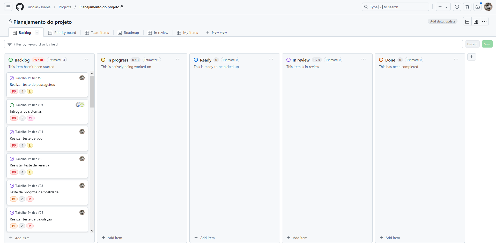
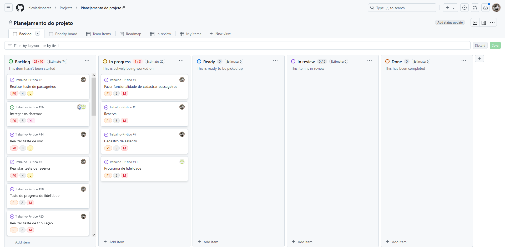
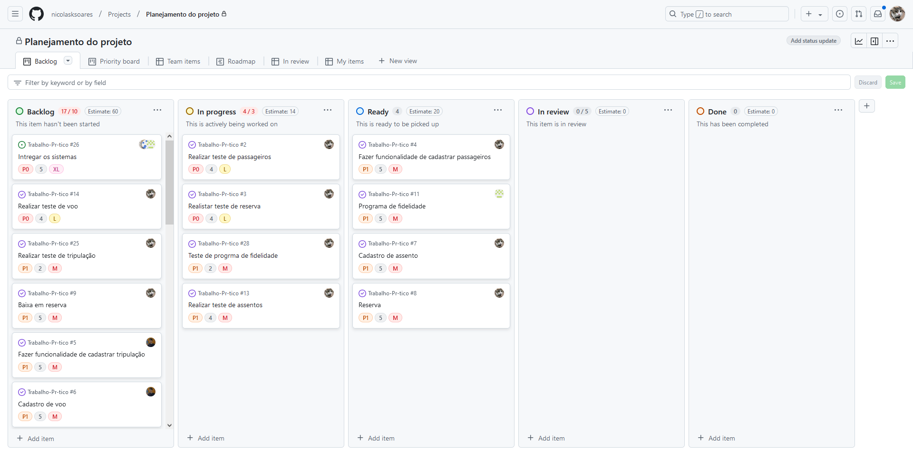
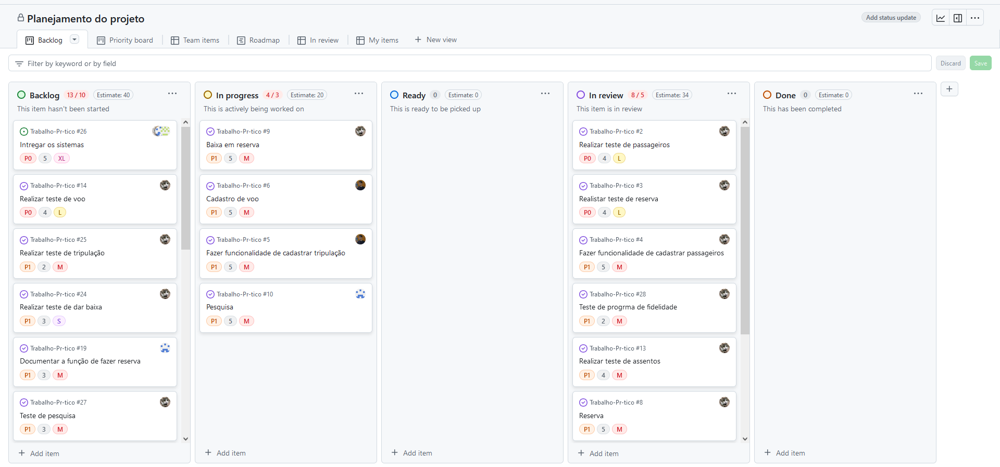
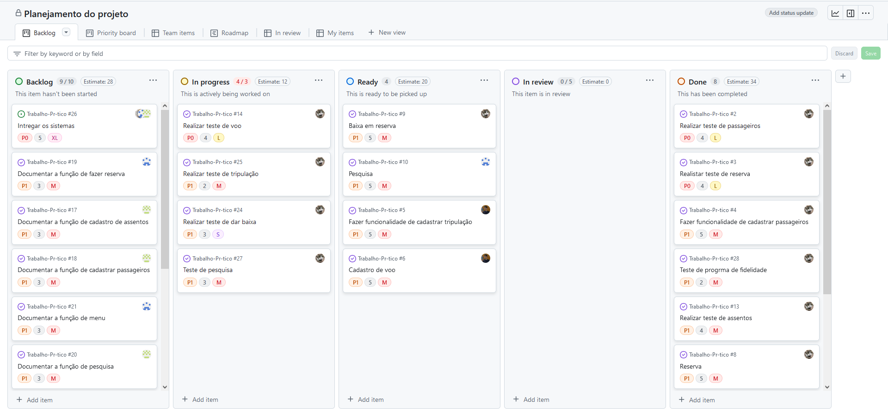
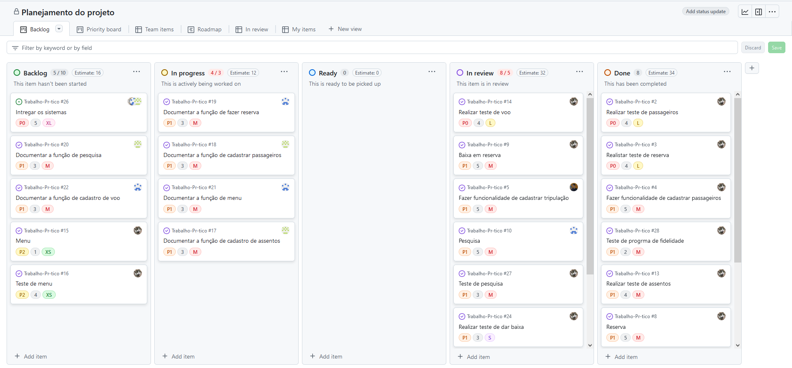
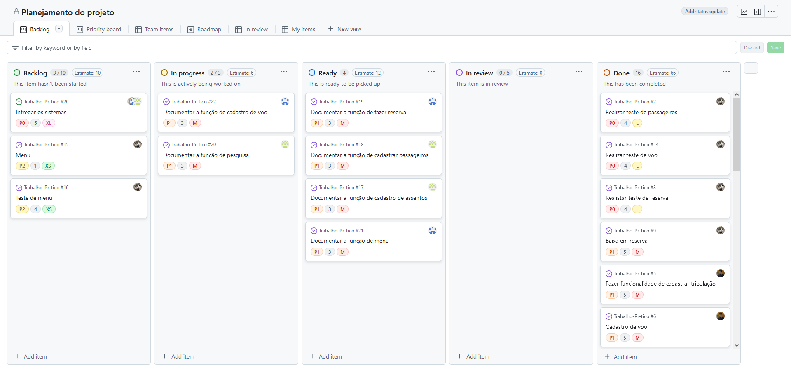
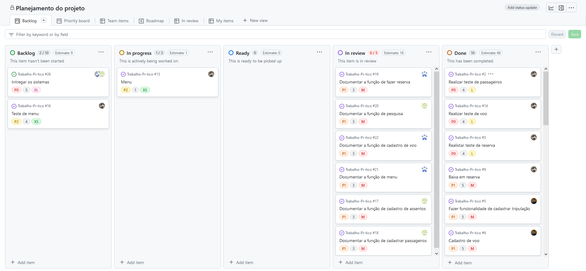
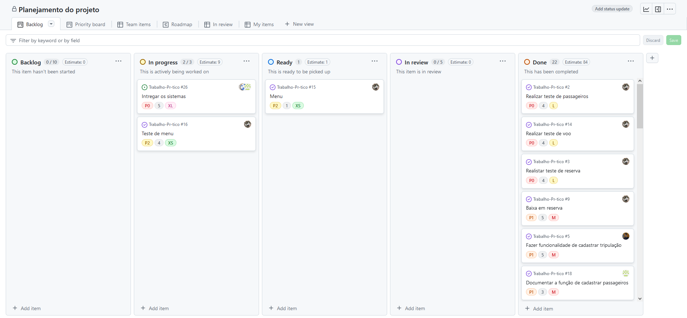
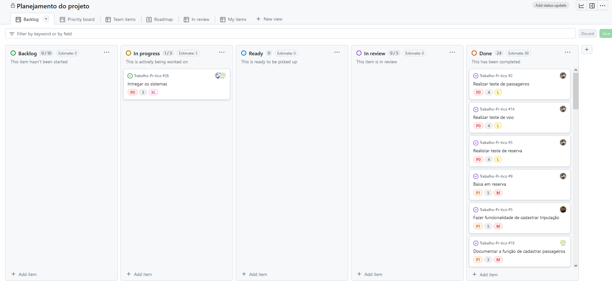

# Trabalho-Prático - Voo Seguro

Pontifícia Universidade Católica de Minas Gerais

Instituto de Ciências Exatas e Informática

Curso de Engenharia de Software

Disciplinas: Algoritmos e Estruturas de Dados I  / Fundamentos de Engenharia de Software

Professores: Carlos Ribas e Laerte                Entrega: 15/12/2024                 Valor: 10 pontos

# Integrantes:

- [Wesley Domingos](https://github.com/WesleySDz)  
- [Nicolas Kiffer](https://github.com/nicolasksoares)  
- [Luiz Moreira](https://github.com/LuizFMoreira)  
- [Matheus Malta](https://github.com/MatheusSMalta)  

# Objetivo:

O objetivo da Voo Seguro é realizar um sistema de gerenciamento para a Voo Seguro, que subtitua os métodos manuais antigos. Para isso propomos um software feito na linguagem C que irá auxiliar-los por meio da automatização do controle de dados. A solução incluirá uma interface intuitiva, projetada para facilitar o uso com uma gama de comandos e funções para isso.

# Video de demostração:

# Backlog to produto:

##Fotos das reuniões:

#Reunião 1

----------------------------------------------------------------------------------------------------------------------------------------------------------------------------------------------------------------------------------------------------------------------------
#Reunião 2

----------------------------------------------------------------------------------------------------------------------------------------------------------------------------------------------------------------------------------------------------------------------------
#Reunião 3

----------------------------------------------------------------------------------------------------------------------------------------------------------------------------------------------------------------------------------------------------------------------------
#Reunião 4

----------------------------------------------------------------------------------------------------------------------------------------------------------------------------------------------------------------------------------------------------------------------------

#Sprint 1: Na primeira imagem, mostramos o quadro Kanban da primeira sprint.

Primeiro, entendemos os requisitos do trabalho e realizamos a divisão das tarefas que cada membro irá realizar, os níveis de dificuldade, o tempo estimado, o tamanho de cada tarefa e os seus níveis de prioridade. Por fim, mostramos os progressos que cada tarefa irá fazer ao decorrer das sprints.

----------------------------------------------------------------------------------------------------------------------------------------------------------------------------------------------------------------------------------------------------------------------------
#Sprint 2: Na segunda imagem, mostramos o quadro Kanban da segunda sprint.

Começamos os primeiros passos para desenvolver o código, iniciando com as funcionalidades de cadastrar passageiro, realizar reserva, cadastrar assento e, por último, o programa de fidelidade(Cada função com seu devido nivel de dificuldade e prioridade).

----------------------------------------------------------------------------------------------------------------------------------------------------------------------------------------------------------------------------------------------------------------------------

#Sprint 3: Na terceira imagem, mostramos o quadro Kanban da terceira sprint. 

Continuamos desenvolvendo o código; as funcionalidades de cadastro de passageiro, realização de reserva, cadastro de assento e o programa de fidelidade foram concluídas e passaram para a etapa de testes. 

----------------------------------------------------------------------------------------------------------------------------------------------------------------------------------------------------------------------------------------------------------------------------

#Sprint 4: Na quarta imagem, mostramos o quadro Kanban da quarta sprint.

Terminamos todas as primeiras funções e seus devidos testes e começamos a revisá-los. Após isso, iniciamos as funcionalidades de dar baixa em reservas, cadastro de voo, cadastro de tripulação e pesquisa.

----------------------------------------------------------------------------------------------------------------------------------------------------------------------------------------------------------------------------------------------------------------------------
#Sprint 5: Na quinta imagem, mostramos o quadro Kanban da quinta sprint.

Realizamos os testes utilizando a biblioteca Unit nas funções que foram realizadas na última sprint (4). Os testes foram nas funções de cadastrar voo, cadastrar tripulação, pesquisar e dar baixa em reservas. Também é perceptível o andamento das nossas tarefas ao longo das sprints. 

----------------------------------------------------------------------------------------------------------------------------------------------------------------------------------------------------------------------------------------------------------------------------
#Sprint 6: Na sexta imagem, mostramos o quadro Kanban da sexta sprint.

Começamos a parte de documentação, realizando a documentação nas funções de fazer reserva, cadastrar passageiros, menu e função de cadastro de assentos, também realizamos a revisão dos codigos e dos testes que foram feitos até o momento.

----------------------------------------------------------------------------------------------------------------------------------------------------------------------------------------------------------------------------------------------------------------------------
#Sprint 7: Na sétima imagem, mostramos o quadro Kanban da sétima sprint. 

Continuamos desenvolvendo o código; as funcionalidades de teste de voo, baixa na reserva, cadastro de tripulação, pesquisa, teste de pesquisa e teste de baixa na reserva já foram revisadas e concluídas. As tarefas de documentação de reserva, documentação de cadastro de passageiros, documentação de menu e documentação de cadastro de assentos foram realizadas e estão aguardando revisão. A documentação de cadastro de voo e a documentação de pesquisa começaram a ser desenvolvidas. 

----------------------------------------------------------------------------------------------------------------------------------------------------------------------------------------------------------------------------------------------------------------------------
#Sprint 8: Na oitava imagem, mostramos o quadro Kanban da oitava sprint. 

Continuamos desenvolvendo a parte de documentação; as tarefas de documentação de reserva, documentação de cadastro de passageiros, documentação de menu, documentação de cadastro de assentos, documentação de cadastro de voo e documentação de pesquisa estão aguardando revisão. O menu começou a ser desenvolvido. 

----------------------------------------------------------------------------------------------------------------------------------------------------------------------------------------------------------------------------------------------------------------------------
#Sprint 9: Na nona imagem, mostramos o quadro Kanban da nona sprint. 

Nessa sprint, todas as tarefas que estavam em revisão foram revisadas e concluídas (documentação de reserva, documentação de cadastro de passageiros, documentação de menu, documentação de cadastro de assentos, documentação de cadastro de voo e documentação de pesquisa). O menu foi finalizado, e as tarefas de integração de todo o código e o teste de menu começaram a ser desenvolvidas. 

----------------------------------------------------------------------------------------------------------------------------------------------------------------------------------------------------------------------------------------------------------------------------
#Sprint 10: Na décima imagem, mostramos o quadro Kanban da décima sprint. 

Todos os testes foram realizados e todos os códigos foram criados. Agora, começamos a juntar todo o programa.

----------------------------------------------------------------------------------------------------------------------------------------------------------------------------------------------------------------------------------------------------------------------------

# Lista de assinaturas das funções e parâmetros
Explicação da estrutura de dados principal do programa.

As funções e parâmetros utilizados no programa foram:

## *1.* int main () - Menu de opções

Função para efetuar qual funcionalidade o usuario irá requerir, basicamente ira gerar um menu de opções e irá solivcitar ao usuario inserir uma opção válida.

## *2.* int verificarEspacosBrancos(const char *str)

Função que recebe um string para verificar se o usuario digitou apenas espaços em brancos em determinadas partes do programa, resolicitando a sua digitação.

## 3. void buscarPassageiro() 

Função que busca o passageiro pelos dados. Aparecerá uma aba perguntando se você deseja pesquisar pelo nome ou pelo código do passageiro. Digite 1 para nome e 2 para o código. Se os dados estiverem errados ou inexistentes, aparecerá a mensagem: "Nenhum passageiro encontrado com o nome informado." Caso o passageiro seja encontrado, serão exibidos o nome, endereço e o status de fidelidade do respectivo passageiro.

## 4. void buscarTripulante()

Função que busca o tripulante pelo nome.Aparecerá uma aba perguntando se você deseja pesquisar pelo nome ou pelo código do tripulante. Digite 1 para nome e 2 para o código.Se os dados estiverem errados ou inexistentes, aparecerá a mensagem: "Nenhum tripulante encontrado com o nome informado." Caso o tripulante seja encontrado, serão exibidos nome, cargo e o telefone do respectivo tripulante.

## 5. void listarVoosPassageiro()

Função que lista todos os voos de um passageiro: A função solicitará que você digite o código do passageiro. Caso o código esteja incorreto ou não exista, será exibida a mensagem: "Passageiro não encontrado." Se o código for válido, serão exibidos todos os voos associados a esse passageiro.

## 6. void pesquisa()

Função de menu de pesquisa. Esta função permite escolher entre buscar passageiros, buscar tripulantes, listar os voos de um passageiro ou sair da aba de pesquisa. A primeira opção direciona para a pesquisa de passageiros, a segunda para a pesquisa de tripulantes, a terceira para a pesquisa de voos do respectivo passageiro, e a quarta encerra a sessão de pesquisa.

## 7. int verificarAssento(int numeroAssento, int codV) 

Função para verificar se o assento escolhido, existe no voo escolhido.  

## 8.  void cadastrarAssento() 

Função para cadastro de assentos. O administrador digita a quantidade máxima de assentos. Se o assento já estiver cadastrado, aparecerá 'assento já cadastrado'. Se os dados do voo estiverem incorretos, aparecerá 'código de voo inválido'. 

## 9.  void listarAssento() 
 
Função para listar a quantidade de assentos no respectivo voo, aparecera a mensagem “Nenhum assento cadastrado” se nenhum assento estiver cadastrado, nesta função você cadastrara o número de assento, o código do respectivo voo, os status do assento, se ele está livre aparecera “livre” e se estiver ocupado aparecera “ocupado”. 

## 10.  void darBaixa() 

Esta função realiza a baixa na reserva de assento do respectivo voo. Nela, você digita o número do assento e o código do voo. Se os dados estiverem corretos, o assento será reservado para o passageiro. Caso algum dos dados esteja errado, aparecerá a mensagem 'assento ou voo não encontrado'. 

## 11. int verificarAssento(int numeroAssento, int codV) 

Função com passagem de parâmetro e com retorno, recebe dois inteiros, os números de assento e o código do voo. É utilizada para verificar se o assento está ocupado ou não.

## 12. int verificarPassageiro(int id) 

Função com passagem de parâmetro e com retorno, recebe o inteiro ID, cuja finalidade é verificar se o passageiro existe.

## 13. void reserva() 

Função que não recebe parâmetros e não retorna nada, garantindo que o passageiro tenha um assento. Ela verifica se o passageiro e o assento estão cadastrados, confirma a disponibilidade e, se todos os dados estiverem corretos, realiza a associação entre o passageiro e o voo.

## 14. int verificarEspacosBrancos(const char *str) 

Função que recebe um string para verificar se o usuario digitou apenas espaços em brancos em determinadas partes do programa, resolicitando a sua digitação. 

## 15. void addPassageiro() 

Função sem passagem de parâmetro e sem retorno, com a finalidade de adicionar os dados dos passageiros (ID, nome, endereço, fidelidade). Ao atingir 99 passageiros, a função exibe a mensagem 'limite de passageiros'. 

## 16. int continua() 

função que não recebe parâmetros e retorna um valor. Essa função tem como objetivo perguntar ao passageiro se ele deseja continuar cadastrando ou encerrar para exibir os cadastros realizados. O retorno será 1 caso o passageiro escolha continuar, e 2 caso opte por parar e visualizar os cadastros. 

## 17. void lerPassageiros() 

Função sem passagem de parametro e sem retorno, que tem como funcionalidade mostra os dados (ID, nome, endereço, telefone, fidelidade) dos passageiros cadastrados. 

## 18. int verificarAssento(int numeroAssento, int codV) 

Função com passagem de parâmetro e com retorno, recebe dois inteiros, os números de assento e o código do voo. É utilizada para verificar se o assento está ocupado ou não.

## 19. int verificarPassageiro(int id) 

Função com passagem de parâmetro e com retorno, recebe o inteiro ID, cuja finalidade é verificar se o passageiro existe.

## 20. void reserva() 

Função que não recebe parâmetros e não retorna nada, garantindo que o passageiro tenha um assento. Ela verifica se o passageiro e o assento estão cadastrados, confirma a disponibilidade e, se todos os dados estiverem corretos, realiza a associação entre o passageiro e o voo.

## 21. void acumularPontos(int idPassageiro)

Função para acumular os pontos obtidos pelo passageiro: Após reservar um assento no voo, o passageiro recebe 10 pontos. Esta função é responsável por acumular os pontos obtidos por cada passageiro.

## 22. void consultarPontos(int idPassageiro)

Função para consultar pontos de fidelidade pelo ID. Esta função mostra o respectivo passageiro e quantos pontos ele tem.

## 23. void fidelidade()

Esta função mostra 3 opções, a primeira é para consultar os pontos de fidelidade, a segunda é para acumular os pontos, e a terceira é para sair da aba de fidelidade. A primeira e segunda você digita o ID do passageiro para consultar os pontos do mesmo.

## 24. void obterString(char mensagem[], char destino []) 

Essa função é responsável por obter uma string válida do usuário. Ela exibe uma mensagem para o usuário e continua solicitando a entrada até que o valor fornecido não seja vazio. 

## 25. Int obterInteiro(char mensagem[]) 

Essa função solicita ao usuário um número inteiro positivo. Ela valida a entrada, garantindo que seja um valor maior que zero. Em caso de erro, informa ao usuário e pede a entrada novamente. 

## 26. Int obterFloat(char mensagem[]) 

Semelhante à função anterior, mas usada para obter um número decimal positivo (valor do tipo float). Também valida a entrada e solicita novamente em caso de erro. 

 
## 27. Int validarData(char Data[]) 

Função com passagem de parâmetro e retorno, que recebe a variável Data e tem como objetivo validar as datas do voo.

## 28. Int validarHora(char hora[]) 

Função com passagem de parâmetro e retorno, que recebe a variável hora e tem como objetivo validar os horários do voo. 

## 29. Int verificarDuplicidade(Voo voos[], int total, Voo novoVoo) 

Função com passagem de parâmetros e retorno, que recebe as variáveis e o struct (Voo voos[], int total, Voo novoVoo) com o objetivo de verificar se há duplicidade de informações entre o novo voo e a lista de voos já cadastrados. 

## 30. Void registrarVoo(Voo *voo, Voo voos[], int totalVoos) 

Função que recebe como parâmetros as variáveis e o struct (Voo *voo, Voo voos[], int totalVoos), cuja finalidade é registrar novos voos, validar os dados do voo, e ver se há duplicidade em voos já cadastrados  

## 31. Void exibierVoo(Voo *voo) 

Função para exibir todos os dados do voo. Mostra os dados como (ID, data, hora, origem, destino, IDS de tripulante, status (ativo ou inativo) e tarifa. 

# TESTES:

## Menu:
|ENTRADAS | CLASSES VÁLIDAS | RESULTADO ESPERADO | CLASSES INVÁLIDAS | RESULTADO ESPERADO|
|--------|-----------------|-------------------|--------------------|-------------------|
|Numeros inteiros | Opção existente | Acessar funcionalidade | Numeros negativos, acima de 8 e nulos | Opção inválida|

## Espaços em brancos
| ENTRADAS         | CLASSES VÁLIDAS          | RESULTADO ESPERADO         | CLASSES INVÁLIDAS             | RESULTADO ESPERADO    |
|-------------------|--------------------------|----------------------------|-------------------------------|-----------------------|
| Texto    |   Texto     | Cadastrar informação     | Espaços brancos, tabulação e nova linha | É solicitadoa ao usuario escrever| novamente o texto|

## Adicionar passageiros
| ENTRADAS         | CLASSES VÁLIDAS          | RESULTADO ESPERADO         | CLASSES INVÁLIDAS             | RESULTADO ESPERADO    |
|-------------------|--------------------------|----------------------------|-------------------------------|-----------------------|
| Informação validas    |   Texto alfabético ou numérico     | Passageiro cadastrado     | Fidelidade com qualquer valor diferente de "Sim" ou "Não". Nome vazio ou caracteres invalidos | É solicitado ao usuario escrever novamente|

## Adicionar tripulação
| ENTRADAS         | CLASSES VÁLIDAS          | RESULTADO ESPERADO         | CLASSES INVÁLIDAS             | RESULTADO ESPERADO    |
|-------------------|--------------------------|----------------------------|-------------------------------|-----------------------|
| Nome, cargo, telefone | Nome com apenas letras e espaços. Codigo numerico representando o cargo. Int com comprimento válido | Tripulante salvo | Nome em branco. Crago com letras, caracteres especiais ou vazios. Telefone com letras, negativos ou vazios | Informar ao usuario erro que não foi possível cadastrar o tripulante |

## Adicionar voo
| ENTRADAS         | CLASSES VÁLIDAS          | RESULTADO ESPERADO         | CLASSES INVÁLIDAS             | RESULTADO ESPERADO    |
|-------------------|--------------------------|----------------------------|-------------------------------|-----------------------|
| Data do voo, horas, origem, destino, id do avião, id do piloto, copiloto, comissario e tarifa | Data e horas válidas; Origem e destino com apenas texto; id do avião não negativo; id od piloto, comissario existente e tarifa não negativa e nula | Registrar as informações correspondentes do voo | Data e horas que não estão no padrão; origem e destino com apenas numero; ids inexistentes; tarifa negativa | Avisar o usuario que não foi possível realizar o cadastramento |

## Adicionar assentos
| ENTRADAS         | CLASSES VÁLIDAS          | RESULTADO ESPERADO         | CLASSES INVÁLIDAS             | RESULTADO ESPERADO    |
|-------------------|--------------------------|----------------------------|-------------------------------|-----------------------|
| Id do assento, codigo do voo | Id dentro do limite e existente, codigo do voo dentro do limite e existente e assento previamente não cadastrado | Cadastrar assento para denterminado voo | Id e codigo de voo negativo, nulo, além do limite e duplicado| Informar ao usuario que os dados não podem ser cadastrados |

## Realizar reservas
| ENTRADAS         | CLASSES VÁLIDAS          | RESULTADO ESPERADO         | CLASSES INVÁLIDAS             | RESULTADO ESPERADO    |
|-------------------|--------------------------|----------------------------|-------------------------------|-----------------------|
| Id do assento, codigo do voo, codigo do pasasgeiro | Ids dentro do limite e existente, codigo do voo dentro do limite e existente, assento não ocupado | Realizar reserva para o codigo do passageiro descrito | Ids negativos e codigo do voo negativo, nulo, além do limite e duplicado | Mostrar que não foi possível realizar a reserva de acordo com a quebra feita |

## Dar baixa em assento
| ENTRADAS         | CLASSES VÁLIDAS          | RESULTADO ESPERADO         | CLASSES INVÁLIDAS             | RESULTADO ESPERADO    |
|-------------------|--------------------------|----------------------------|-------------------------------|-----------------------|
| Numero e codigo do voo| Assento previamente reservado e existente | Altere o status para livre e remova o ID do passageiro |  Assento inexistente ou livre | Informar que o assento não está reservado ou inexistente|

## Pesquisar
| ENTRADAS         | CLASSES VÁLIDAS          | RESULTADO ESPERADO         | CLASSES INVÁLIDAS             | RESULTADO ESPERADO    |
|-------------------|--------------------------|----------------------------|-------------------------------|-----------------------|
| Id, nome do passageiro ou do tripulante solicitado | Passageiro pre-existente, assentos pré-reservados, tripulantes já cadastrados | Mostar ao usuario informações a respeito | Id, nome não existente e não cadastro de nehum assento | Avisar ao usuario que não foi possível realizar a operação |

## Fidelidade
| ENTRADAS         | CLASSES VÁLIDAS          | RESULTADO ESPERADO         | CLASSES INVÁLIDAS             | RESULTADO ESPERADO    |
|-------------------|--------------------------|----------------------------|-------------------------------|-----------------------|
| Codigo de pasasgeiro | Passageiro previamente cadastrado e com fidelidade | Acumular 10 pontos ao passageiro. Mostrar a quantidade de pontos do passageiro | Passageiro não cadastrado previamente ou passageiro sem fidelidade |Ilustrar ao ussuario que não foi possivel realizar a operação |

# RELATORIO DE EXECUÇÃO DE TESTES:
## Menu: 
Teste 1: Menu de opções

| ENTRADAS         | CLASSES VÁLIDAS          | RESULTADO ESPERADO         | CLASSES INVÁLIDAS             | RESULTADO ESPERADO    |
|-------------------|--------------------------|----------------------------|-------------------------------|-----------------------|
| Número inteiro    | Números de 1 a 8        | Acessar funcionalidade     | Números negativos, acima de 8 e nulos | Opção inválida |      

 Relatório de execução de testes

| ENTRADAS   | RESULTADO                | APROVADOS |
|------------|--------------------------|-----------|
| Valor: -5  | Opção inválida           | Sim       |
| Valor: 0   | Opção inválida           | Sim       |
| Valor: 1   | Cadastrar Passageiro     | Sim       |
| Valor: 2   | Cadastrar Tripulação     | Sim       |
| Valor: 3   | Cadastrar Voo            | Sim       |
| Valor: 4   | Cadastrar Assento        | Sim       |
| Valor: 5   | Reserva                  | Sim       |
| Valor: 6   | Baixa em reserva         | Sim       |
| Valor: 7   | Pesquisa                 | Sim       |
| Valor: 8   | Programa de fidelidade   | Sim       |
| Valor: 20  | Opção inválida           | Sim       |
## Espaço em branco
Teste 1: Verificar espaços brancos
| ENTRADAS         | CLASSES VÁLIDAS          | RESULTADO ESPERADO         | CLASSES INVÁLIDAS             | RESULTADO ESPERADO    |
|-------------------|--------------------------|----------------------------|-------------------------------|-----------------------|
| String    |   String     | Cadastrar informação     | Espaços brancos, tabulação e nova linha | É solicitadoa ao usuario escrevre |novamente o texto|

Relatório de execução de testes:

| ENTRADAS     | RESULTADO                | APROVADOS |
|--------------|--------------------------|-----------|
| Valor: " "   | Texto invalido           | Sim       |
| Valor: "Bom" | Texto válido             | Sim       |
| Valor: ""    | Texto invalido           | Sim       |
| Valor: \t\n  | Texto invalido           | Sim       |
| Valor: " Opa"| Texto Válido         | Sim       |

## Adicionar passageiros
Teste 1: Verificar adicionamento de passageiros
| ENTRADAS         | CLASSES VÁLIDAS          | RESULTADO ESPERADO         | CLASSES INVÁLIDAS             | RESULTADO ESPERADO    |
|-------------------|--------------------------|----------------------------|-------------------------------|-----------------------|
|  Strings e inteiros   |   Texto valido, pontos não negativos e fidelidade como 1 ou 2     | Informar ao usuario os dados cadastrados     | Strings vazias, numeros negativos e opçoes além do escopo de opção | É solicitado ao usuario escrever novamente| 

Relatorio de execução de testes:
| ENTRADAS     | RESULTADO                | APROVADOS |
|--------------|--------------------------|-----------|
| Nome: "Wesley"   | Texto válido           | Sim       |
| Endereço: "Rua" | Texto válido             | Sim       |
| Numero: "40028922"    | Texto válido           | Sim       |
| Fidelidade: "1"  | Opção válida          | Sim       |
| Pontos: "1500"| Quantidade válida         | Sim       |

## Adicionar tripulação
Teste 1: Adicionar tripulação
| ENTRADAS         | CLASSES VÁLIDAS          | RESULTADO ESPERADO         | CLASSES INVÁLIDAS             | RESULTADO ESPERADO    |
|-------------------|--------------------------|----------------------------|-------------------------------|-----------------------|
| Strings e inteiros | Numeros não negativos e não nulos, telefone com no minimo 8 caracteres. Nome sem ser espaços em brancos. Cargo dentro do limite | Cadastro realizado | Numeros negativos e nulos, telefone com menos de 8 caracteres. Nome em branco | Registro não realizado |

Relatorio de execução de testes:
| ENTRADAS     | RESULTADO                | APROVADOS |
|--------------|--------------------------|-----------|
| Id: "1"      | Id salvo                 | Sim       |
| Nome: "João" | Nome salvo               | Sim       |
| Cargo: "1"   | Cargo salvo              | Sim       |
| Telefone: "40028922" | Telefone salvo   | Sim       |

Teste 2: Verificar cargos
| ENTRADAS         | CLASSES VÁLIDAS          | RESULTADO ESPERADO         | CLASSES INVÁLIDAS             | RESULTADO ESPERADO    |
|-------------------|--------------------------|----------------------------|-------------------------------|-----------------------|
| Inteiros | Piloto : 1, Copiloto: 2, Comissário: 3 | Registrar o cargo | Negativo, nulo, maior que 3 | Peder novamente a inserção |

Relatorio de execução de testes:
| ENTRADAS     | RESULTADO                | APROVADOS |
|--------------|--------------------------|-----------|
| Cargo: "1"   |  Piloto                  | Sim       |
| Cargo: "2"   |  Copiloto                | Sim       |
| Cargo: "3"   |  Comissário              | Sim       |
| Cargo: "0"   |  Inexistente             | Sim       |
| Cargo: "-5"  |  Inexistente             | Sim       |
| Cargo: "17"  |  Inexistente             | Sim       |

Teste 3: Verificar telefone
| ENTRADAS         | CLASSES VÁLIDAS          | RESULTADO ESPERADO         | CLASSES INVÁLIDAS             | RESULTADO ESPERADO    |
|-------------------|--------------------------|----------------------------|-------------------------------|-----------------------|
| Inteiros   |   Telefones com mais de 8 digitos e não negativos | Telefone cadastrado | Telefone com menos de 8 digitos e negativos | Telefone não cadastrado |

Relatorio de execução de testes:
| ENTRADAS     | RESULTADO                | APROVADOS |
|--------------|--------------------------|-----------|
| Telefone: "-12345678" |  Telefone não válido  | Sim       |
| Telefone: "12345" |  Telefone não válido  | Sim       |
| Telefone: "40028922" |  Telefone válido  | Sim       |

## Adicionar voo
Teste 1: Menu de opções
| ENTRADAS         | CLASSES VÁLIDAS          | RESULTADO ESPERADO         | CLASSES INVÁLIDAS             | RESULTADO ESPERADO    |
|-------------------|--------------------------|----------------------------|-------------------------------|-----------------------|
| Inteiros  | Numeros entre 1 a 3 | Executar a funcionalidade que está associada | Números negativos, nulos ou  maiores que 3 | Pedir novamente uma inserção válida ao usúario |

Relatorio de execução de testes:
| ENTRADAS     | RESULTADO                | APROVADOS |
|--------------|--------------------------|-----------|
| Valor: "-1"  | Opção inexistente        | Sim       |
| Valor: "0"   | Opção inexistente        | Sim       |
| Valor: "1"   | Cadastrar voo            | Sim       |
| Valor: "2"   | Exibir voos cadastrados  | Sim       |
| Valor: "3"   | Sair do menu             | Sim       |
| Valor: "17"  | Opção inexistente        | Sim       |

Teste 2: Adcionar voo
| ENTRADAS         | CLASSES VÁLIDAS          | RESULTADO ESPERADO         | CLASSES INVÁLIDAS             | RESULTADO ESPERADO    |
|-------------------|--------------------------|----------------------------|-------------------------------|-----------------------|
| Inteiros e string | Numeros inteiros positivos e ids existentes; String com apenas texto | Cadastrar o voo | Numeros negativos, nulo e ids inexistentes e strings com apenas numeros | Executar um erro, não foi possível cadastrar |

Deixamos pré definidos 4 Voos e executamos teste baseados neles:
1.Data: 01/01/2025, Hora: 12:00, Origem: São Paulo, Destino: Rio de Janeiro, ID Avião: 101, ID Piloto: 1, ID Copiloto: 2, ID Comissário: 3, Status: Ativo, Tarifa: R$ 150,00
2. Data: 02/01/2025, Hora: 15:30, Origem: Rio de Janeiro, Destino: São Paulo, ID Avião: 102, ID Piloto: 4, ID Copiloto: 5, ID Comissário: 6, Status: Ativo, Tarifa: R$ 180,00  
3. Data: 03/01/2025, Hora: 08:00, Origem: São Paulo, Destino: Brasília, ID Avião: 103, ID Piloto: 7, ID Copiloto: 8, ID Comissário: 9, Status: Inativo, Tarifa: R$ 200,00  
4. Data: 04/01/2025, Hora: 17:00, Origem: Brasília, Destino: Fortaleza, ID Avião: 104, ID Piloto: 10, ID Copiloto: 11, ID Comissário: 12, Status: Ativo, Tarifa: R$ 220,00

Relatorio de execução de teste
| ENTRADAS     | RESULTADO                | APROVADOS |
|--------------|--------------------------|-----------|
| Data: 05/01/2025, Hora: 10:00, Origem: Fortaleza, Destino: São Paulo, ID Avião: 105, ID Piloto: 13, ID Copiloto: 14, ID Comissário: 15, Status: Ativo, Tarifa: R$ 230,00 | Cadastrado com sucesso | Sim |
| Data: 02/01/2025, Hora: 15:30, Origem: Rio de Janeiro, Destino: São Paulo, ID Avião: 102, ID Piloto: 4, ID Copiloto: 5, ID Comissário: 6, Status: Ativo, Tarifa: R$ 180,00 | Voo duplicado | Sim |

## Adicionar assentos

Teste 1:  Limite de assentos cadastrados atingido
| ENTRADAS         | CLASSES VÁLIDAS          | RESULTADO ESPERADO         | CLASSES INVÁLIDAS             | RESULTADO ESPERADO    |
|-------------------|--------------------------|----------------------------|-------------------------------|-----------------------|
| Inteiros         | Valores maiores que o limite| Erro ao cadastrar       | Numeros dentro do limite      | Executar a função de cadastrar     | Cadastro com sucesso |

Relatorio de execução de teste
| ENTRADAS     | RESULTADO                | APROVADOS |
|--------------|--------------------------|-----------|
| Valor: "10000"   | Impossivel cadastrar           | Sim       |

Teste 2: Cadastrar assento
| ENTRADAS         | CLASSES VÁLIDAS          | RESULTADO ESPERADO         | CLASSES INVÁLIDAS             | RESULTADO ESPERADO    |
|-------------------|--------------------------|----------------------------|-------------------------------|-----------------------|
| Inteiros         | Numeros inteiros positivos e não nulos que não extrapolam o limite| Cadastrar o assento | Numeros negativos, nulo e que extrapolam o limite| Informar ao usuario uma nova solicitação|

Relatorio de execução de teste
| ENTRADAS     | RESULTADO                | APROVADOS |
|--------------|--------------------------|-----------|
| Assento: -1 Voo: -5 |   Cadastro inválido         | Sim       |
| Assento: -1 Voo: 0 |   Cadastro inválido         | Sim       |
| Assento: -1 Voo: 5 |   Cadastro inválido         | Sim       |
| Assento: 0 Voo: -5 |   Cadastro inválido         | Sim       |
| Assento: 0 Voo: 0 |   Cadastro inválido         | Sim       |
| Assento: 0 Voo: 5 |   Cadastro inválido         | Sim       |
| Assento: 17 Voo: -5 |   Cadastro inválido         | Sim       |
| Assento: 17 Voo: 0 |   Cadastro inválido         | Sim       |
| Assento: 17 Voo: 5 |   Cadastro válido         | Sim       |

Teste 3: Verificar assento vazios
| ENTRADAS         | CLASSES VÁLIDAS          | RESULTADO ESPERADO         | CLASSES INVÁLIDAS             | RESULTADO ESPERADO    |
|-------------------|--------------------------|----------------------------|-------------------------------|-----------------------|
| Inteiros         | Listar assentos sem antes cadastrar | Informar que não existe | Listar assentos já pre-cadastrados | Mostrar o sassentos cadastrados|

Relatorio de execução de teste
| ENTRADAS     | RESULTADO                | APROVADOS |
|--------------|--------------------------|-----------|
| Total de assentos: 0 |   Busca inválida         | Sim       |

Teste 4: Assento duplicado
| ENTRADAS         | CLASSES VÁLIDAS          | RESULTADO ESPERADO         | CLASSES INVÁLIDAS             | RESULTADO ESPERADO    |
|-------------------|--------------------------|----------------------------|-------------------------------|-----------------------|
| Inteiros         | Repeti o mesmo numero de assento e voo | Informar que o assento já existe | Informar outro assento | Realizar o cadastro|

Relatorio de execução de teste
Cadastramos o assento 17 05 e verificamos se ele já é existente
| ENTRADAS     | RESULTADO                | APROVADOS |
|--------------|--------------------------|-----------|
| Assento: 17 Voo: 5 |   Voo duplicado         | Sim       |

## Realizar reserva
Teste 1: Assento livre
| ENTRADAS         | CLASSES VÁLIDAS          | RESULTADO ESPERADO         | CLASSES INVÁLIDAS             | RESULTADO ESPERADO    |
|-------------------|--------------------------|----------------------------|-------------------------------|-----------------------|
| Inteiros   | Assento pre-cadastrado, livre, passageiro cadastrado | Reserva feita com sucesso | Assento inexistente, ocupado, passageiro não encontrado | Reserva não concluída |

Relatorio de execução de teste
| ENTRADAS     | RESULTADO                | APROVADOS |
|--------------|--------------------------|-----------|
| Assento: 17  Voo: 5 Passageiro: 1 | Assento   reservado |  Sim    |

Teste 2: Assento ocupado
| ENTRADAS         | CLASSES VÁLIDAS          | RESULTADO ESPERADO         | CLASSES INVÁLIDAS             | RESULTADO ESPERADO    |
|-------------------|--------------------------|----------------------------|-------------------------------|-----------------------|
| Inteiros   | Assento com status ocupado | Não foi possivel cadastrar | Assento com status livre | Reserva feita |

Relatorio de execução de teste
| ENTRADAS     | RESULTADO                | APROVADOS |
|--------------|--------------------------|-----------|
| Assento: 17  Voo: 5 Passageiro: 1 | Assento ocupado |  Sim    |

Teste 3: Assento não encontrado
| ENTRADAS         | CLASSES VÁLIDAS          | RESULTADO ESPERADO         | CLASSES INVÁLIDAS             | RESULTADO ESPERADO    |
|-------------------|--------------------------|----------------------------|-------------------------------|-----------------------|
| Inteiros | Assento não cadastrado previamente | Não foi possivel realizar a reserva | Assento previamente cadastrado | Reserva feita |

Definimos um unico assento 17, 05

Relatorio de execução de teste
| ENTRADAS     | RESULTADO                | APROVADOS |
|--------------|--------------------------|-----------|
| Assento: 18 Voo: 5  | Assento não encontrado |  Sim    |
| Assento: -5 Voo: 0  | Assento não encontrado |  Sim    |
| Assento: 5 Voo: 0  | Assento não encontrado |  Sim    |

Teste 4: Passageiro não encontrado
| ENTRADAS         | CLASSES VÁLIDAS          | RESULTADO ESPERADO         | CLASSES INVÁLIDAS             | RESULTADO ESPERADO    |
|-------------------|--------------------------|----------------------------|-------------------------------|-----------------------|
| Inteiros | Passageiro cadastrado  | Assento reservado com sucesso | Id do passageiro não cadastrado | Erro ao fazer reserva |

Definimos um unico passageiro com id=1

Relatorio de execução de teste
| ENTRADAS     | RESULTADO                | APROVADOS |
|--------------|--------------------------|-----------|
| Assento: 17 Voo: 5 Passageiro: -1 | Passageiro não encontrado |  Sim    |

## Dar baixa em assento

Teste 1: Tentar da baixa em assento ocupado, não existente ou livre
| ENTRADAS         | CLASSES VÁLIDAS          | RESULTADO ESPERADO         | CLASSES INVÁLIDAS             | RESULTADO ESPERADO    |
|-------------------|--------------------------|----------------------------|-------------------------------|-----------------------|
| Inteiros         | Assentos existentes      | Informar ao usuario que o assento foi desocupado e transforma o seu status em livre e desvincular o passageiro vinculado | Assento inexistente ou não ocupado | Infprmar ao usuario que o assento digitado não existe ou está livre |

Colocamos tres acertos e tentamos da baixa em cada um.

Definimos o primeiro teste com um assento ocupado e existente codigo 17, voo 5, ocupado.

Definimos o segundo teste com um assento livre e existente codigo 22, voo 5, livre.

Definimos o terciro teste com um assento inexiste. O original é 27, 5.

Relatorio de execução de teste
| ENTRADAS     | RESULTADO                | APROVADOS |
|--------------|--------------------------|-----------|
| id="17" voo="5"    | Baixa com sucesso  | Sim       |
| id="22" voo="5"    | Assento não está ocupado | Sim |
| id="29" voo="15"   | Assento não existe | Sim       |

## Pesquisar

Teste 1: Menu de opções
| ENTRADAS         | CLASSES VÁLIDAS          | RESULTADO ESPERADO         | CLASSES INVÁLIDAS             | RESULTADO ESPERADO    |
|-------------------|--------------------------|----------------------------|-------------------------------|-----------------------|
| Inteiros | Numeros entre 1 a 4 | Acessar funcionalidade | Numeros negativos, nulos ou acima de 4 | Solicitar novamente a inserção da opção |

Relatorio de execução de teste

| ENTRADAS     | RESULTADO                | APROVADOS |
|--------------|--------------------------|-----------|
| Valor: "-1"  | Opção inexistente        | Sim       |
| Valor: "0"   | Opção inexistente        | Sim       |
| Valor: "1"   | Buscar passageiro        | Sim       |
| Valor: "2"   | Buscar tripulante        | Sim       |
| Valor: "3"   | Listar voos de passageiro     | Sim       |
| Valor: "4"   | Sair do menu             | Sim       |
| Valor: "17"  | Opção inexistente        | Sim       |

Teste 2: Buscar Passageiros:
| ENTRADAS         | CLASSES VÁLIDAS          | RESULTADO ESPERADO         | CLASSES INVÁLIDAS             | RESULTADO ESPERADO    |
|-------------------|--------------------------|----------------------------|-------------------------------|-----------------------|
| Inteiros ou string | Passageiro previamente cadastrado | Mostrar detalhes a respeito do passageiro | Passageiro inexistente | Informar ao usuario que não foi possivel encontrar |

Definimos 3 passageiros:
1. Nome: Wesley, Enderenço: Rua 170, Telefone: 98765431
2. Nome: Pedro, Enderenço: Avenida 051, Telefone: 123456789
3. Nome: Maria, Enderenço: Rua 017, Telefone: 321654987

Relatorio de execução de teste

| ENTRADAS     | RESULTADO                | APROVADOS |
|--------------|--------------------------|-----------|
| Nome: Wesley | Mostrou as informações   | Sim       |
| Nome: Mauro  | Informou que não existe  | Sim       |
| Id: 1        | Mostrou as informações   | Sim       |
| Id: 999      | Informou que não existe  | Sim       |

Teste 3: Buscar Tripulante:
| ENTRADAS         | CLASSES VÁLIDAS          | RESULTADO ESPERADO         | CLASSES INVÁLIDAS             | RESULTADO ESPERADO    |
|-------------------|--------------------------|----------------------------|-------------------------------|-----------------------|
| Inteiros ou strings | Tripulante previamente cadastrado | Mostrar os detalhes a respeito do tripulante | Tripulante inexistente |  Avisar ao usuario que não foi possivel encontrar |

Definimos 3 tripulantes:
1. Nome: Neymar, Cargo: 1, Telefone: 40028922
2. Nome: Lionel Messi, Cargo: 2, Telefone: 987654321
3. Nome: Cristiano Ronaldo, Cargo: 3, Telefone: 1122334455

Relatorio de execução de teste
 
| ENTRADAS     | RESULTADO                | APROVADOS |
|--------------|--------------------------|-----------|
| Nome: Neymar | Mostrou as informações   | Sim       |
| Nome: Ney    | Informou que não existe  | Sim       |
| Id: 1        | Mostrou as informações   | Sim       |
| Id: 999      | Informou que não existe  | Sim       |

Teste 4: Listar voos
| ENTRADAS         | CLASSES VÁLIDAS          | RESULTADO ESPERADO         | CLASSES INVÁLIDAS             | RESULTADO ESPERADO    |
|-------------------|--------------------------|----------------------------|-------------------------------|-----------------------|
| Inteiros | Passageiro com assento previamente registrado | Listar todos os voo marcados daquele passageiro | Passsageiro inexistente ou sem reserva | Informar que o passageiro não existe ou não tem voos no nome |

Relatorio de execução de teste

| ENTRADAS     | RESULTADO                | APROVADOS |
|--------------|--------------------------|-----------|
| Id: 1        | Mostrou as informações   | Sim       |
| Id: 2        | Mostrou as informações   | Sim       |
| Id: 999      | Passageiro não encontrado         | Sim       |
| Id: -1       | Passageiro não encontrado         | Sim       |

## Fidelidade

Teste 1: Menu de opções
| ENTRADAS         | CLASSES VÁLIDAS          | RESULTADO ESPERADO         | CLASSES INVÁLIDAS             | RESULTADO ESPERADO    |
|-------------------|--------------------------|----------------------------|-------------------------------|-----------------------|
| Inteiros | Numeros entre 1 a 3 | Acessar funcionalidade | Informar ao usuario a quantidade de pontos do usuario, ou acumular pontos ao usuario | Numeros negativos, nulos ou acima de 3 | Solicitar novamente a inserção da opção |

Relatorio de execução de teste

| ENTRADAS     | RESULTADO                | APROVADOS |
|--------------|--------------------------|-----------|
| Valor: "-1"  | Opção inexistente        | Sim       |
| Valor: "0"   | Opção inexistente        | Sim       |
| Valor: "1"   | Consultar pontos         | Sim       |
| Valor: "2"   | Acumular pontos          | Sim       |
| Valor: "3"   | Sair do menu             | Sim       |
| Valor: "17"  | Opção inexistente        | Sim       |

Teste 2: Consultar pontos
| ENTRADAS         | CLASSES VÁLIDAS          | RESULTADO ESPERADO         | CLASSES INVÁLIDAS             | RESULTADO ESPERADO    |
|-------------------|--------------------------|----------------------------|-------------------------------|-----------------------|
| Inteiros | Codigo de passageiro existente e que possui fidelidade| Mostrar a quantidade de pontos que possui | Codigo inexistente, negativo ou nulo | Informar que não foi encontrado o passageiro|

Relatorio de execução de teste

| ENTRADAS     | RESULTADO                | APROVADOS |
|--------------|--------------------------|-----------|
| Id: "1"      | Passageiro encontrado    | Sim       |
| Id: "0"      | Passageiro não encontrado | Sim      |
| Id: "-1"     | Passageiro encontrado    | Sim       |

Teste 3: Acumular pontos
| ENTRADAS         | CLASSES VÁLIDAS          | RESULTADO ESPERADO         | CLASSES INVÁLIDAS             | RESULTADO ESPERADO    |
|-------------------|--------------------------|----------------------------|-------------------------------|-----------------------|
| Inteiros | Código de passageiro existente e que possui fidelidade | Adicionar 10 pontos de fidelidade ao usuario | Código inexistente, negativo, não, nulo ou que não tem fidelidade | Informar que não foi possivel acumular pontos |

Relatorio de execução de teste

| ENTRADAS     | RESULTADO                | APROVADOS |
|--------------|--------------------------|-----------|
| Id: "1"      | Mais 10 pontos acumulado   | Sim       |
| Id: "0"      | Não foi possivel encontrar | Sim      |
| Id: "-1"     | Não foi possível encontrar    | Sim       |
